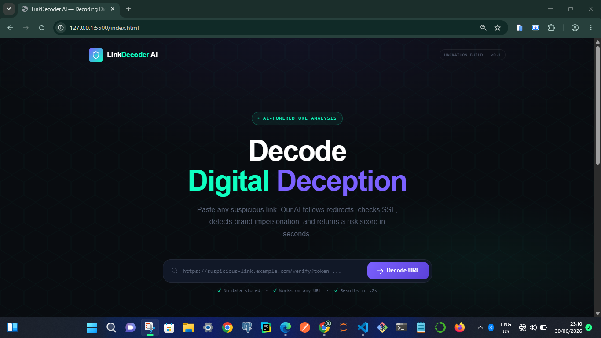
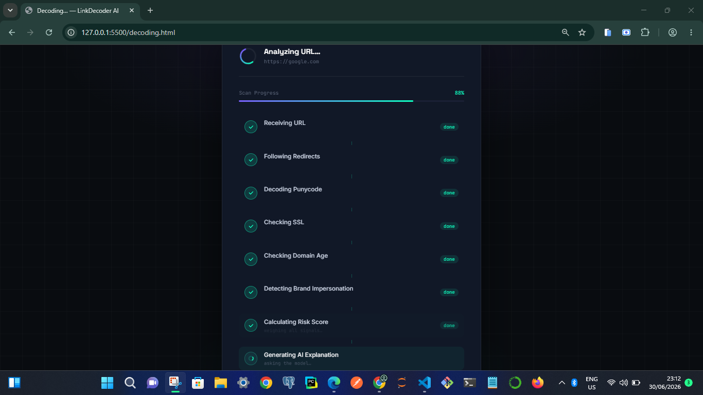
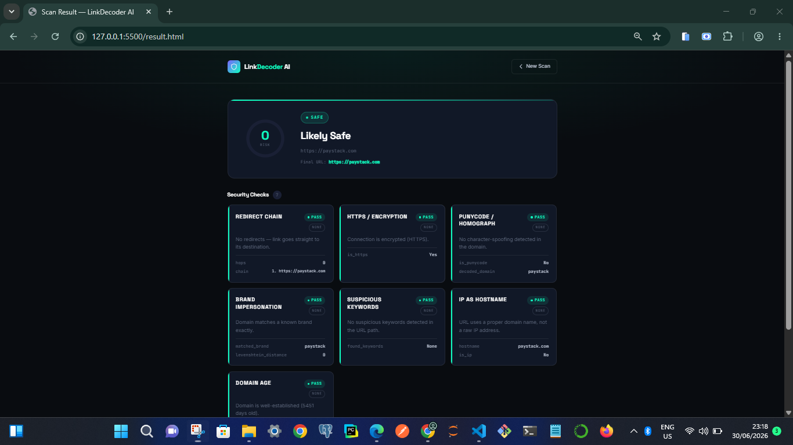

# 🎯 LinkDecoder AI Frontend

> **Decoding Digital Deception — One URL at a Time**

The frontend interface for **LinkDecoder AI**, built for the **NACOS Hackathon 2026** under the theme **"Decoding Systems."**

This project provides a clean, responsive, and user-friendly interface for analyzing suspicious URLs. It communicates with a backend security engine through a REST API and presents the scan results in an easy-to-understand format.

---

## ✨ Features

- URL input and validation
- Animated decoding/loading experience
- Risk score visualization
- Color-coded security status indicators
- AI explanation section
- Fully responsive design
- Modern cybersecurity-inspired UI
- Dynamic rendering of security checks

---

## Pages

### Landing Page

- Hero section
- URL input field
- Decode button
- Project overview

###  Decoding Page

- Animated scan progress
- Loading indicators
- Smooth transitions

###  Results Page

- Risk score
- Verdict badge
- Security check cards
- AI explanation
- Final destination URL
- Scan summary

---

##  Tech Stack

- HTML5
- CSS3
- Vanilla JavaScript (ES6)
- Fetch API

---

## 📂 Project Structure

```
frontend/
│
├── index.html
├── decoding.html
├── result.html
│
├── css/
│   └── style.css
│
├── js/
│   ├── api.js
│   ├── config.js
│   ├── decoder.js
│   ├── result.js
│   └── ui.js
│
└── assets/
```

---

## 🌐 API Integration

The frontend communicates with a REST API that performs URL analysis and returns structured scan results.

The frontend is designed to:

- Send URLs for analysis
- Display loading states during scans
- Handle API errors gracefully
- Dynamically render scan results
- Present AI-generated explanations in a user-friendly way

---

## 🚀 Running the Frontend

Clone the repository:

```bash
git clone <https://github.com/rockytiM-5205/Link_Decoder.git
>
```

Open the project folder and launch `index.html` using a local server such as **Live Server** in Visual Studio Code.

Make sure the backend API is running before performing scans.

---

## Screenshots

### Landing Page



### Decoding Screen



### Results Page



---

## 🎯 Project Goal

LinkDecoder AI helps users make safer decisions by transforming complex URL scan results into a clear, visual, and easy-to-understand experience.

The frontend focuses on usability, accessibility, and presenting technical security information in a way that everyday users can understand.

---

## 👨‍💻 My Contribution

For this project, I was responsible for:

- Frontend development
- User interface (UI) design
- User experience (UX)
- Responsive layout
- API integration
- Loading animations
- Result visualization
- AI explanation presentation

---

## 📄 License

Developed as part of the **NACOS Hackathon 2025**.
